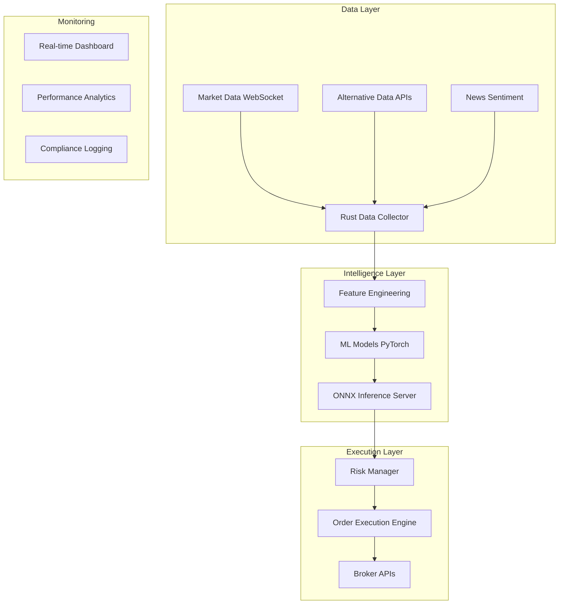

# 🚀 Advanced Quantitative Trading System (in theory)

> **AI-powered, high-frequency trading system built in Rust with alternative data integration and sub-millisecond execution**

## 📋 Executive Summary

A production-grade quantitative trading system designed to generate alpha through:
- **Ultra-low latency execution** (sub-10ms end-to-end)
- **Alternative data exploitation** (congressional trades, government contracts, real-time news)
- **AI-powered decision making** with explainable predictions
- **Risk-managed position sizing** using modern portfolio theory

**Target Performance**: Sharpe ratio >1.5, maximum drawdown <15%, 99.9% uptime during market hours.

---

## 🏗️ System Architecture



## 🎯 Competitive Advantages

### 1. **Speed & Performance**
- **Rust-based execution engine**: Zero-cost abstractions, no garbage collection
- **WebSocket tick processing**: 10,000+ market updates per second
- **ONNX model inference**: Sub-2ms prediction latency
- **Lock-free data structures**: Optimized for high-frequency scenarios

### 2. **Alternative Data Edge**
- **Congressional trading alerts**: React to political insider information
- **Government contract tracking**: Defense, healthcare, infrastructure opportunities
- **Real-time news sentiment**: NLP-powered market event detection
- **Multi-source correlation**: Combine price action with fundamental catalysts

### 3. **AI-Powered Intelligence**
- **Ensemble models**: XGBoost + Neural Networks + Time-series transformers
- **Feature engineering**: 200+ technical and fundamental indicators
- **Model explainability**: Real-time reasoning for every trading decision
- **Continuous learning**: Automated retraining on new market patterns

### 4. **Enterprise-Grade Infrastructure**
- **Microservices architecture**: Independently scalable components
- **Event-driven design**: Kafka/Redis for real-time data streaming
- **Fault tolerance**: Circuit breakers, graceful degradation, automatic recovery
- **Observability**: Prometheus metrics, distributed tracing, performance dashboards

---

## 🛠️ Technology Stack

### **Backend (Rust)**
```rust
// High-performance async runtime
tokio = { version = "1.0", features = ["full"] }
// WebSocket & HTTP clients  
reqwest = "0.11"
// Serialization
serde = { version = "1.0", features = ["derive"] }
// Database integration
sqlx = { version = "0.7", features = ["postgres", "chrono"] }
// ML inference
onnxruntime = "1.16"
```

### **Machine Learning (Python)**
- **Training**: PyTorch, Scikit-learn, XGBoost, LightGBM
- **Feature Engineering**: Pandas, NumPy, TA-Lib, NLTK
- **Model Serving**: ONNX Runtime, TorchServe
- **Research**: Jupyter, Plotly, Weights & Biases

### **Infrastructure**
- **Database**: PostgreSQL + TimescaleDB for time-series data
- **Caching**: Redis for real-time state management  
- **Monitoring**: Prometheus + Grafana + Sentry
- **Deployment**: Docker + Kubernetes + AWS/GCP
- **CI/CD**: GitHub Actions with automated testing

---

## 📊 Current Implementation Status

### ✅ **Completed (Phase 1)**
- [x] **Rust workspace architecture** with shared types
- [x] **Trading data structures** (MarketTick, TradingSignal, Order)
- [x] **Error handling & configuration** management
- [x] **Service scaffolding** for data collector and execution engine

### 🚧 **In Progress (Phase 2)**
- [ ] **WebSocket market data ingestion** (Polygon.io integration)
- [ ] **Alternative data pipeline** (QuiverQuant, USAspending.gov APIs)
- [ ] **PostgreSQL/TimescaleDB** integration for tick storage
- [ ] **Basic ML model** training and ONNX export

### 📅 **Planned (Phase 3)**
- [ ] **Advanced feature engineering** (200+ indicators)
- [ ] **Ensemble ML models** with hyperparameter optimization
- [ ] **Risk management system** (Kelly criterion, correlation limits)
- [ ] **Order execution** with broker integrations (Alpaca, IBKR)
- [ ] **Real-time dashboard** with performance analytics
- [ ] **Paper trading validation** before live deployment

---

## 🚀 Performance Targets

| Metric | Target | Business Impact |
|--------|--------|----------------|
| **End-to-end Latency** | <10ms | Capture fleeting arbitrage opportunities |
| **Data Throughput** | 10k+ ticks/sec | Handle market volatility and high-volume periods |
| **Prediction Accuracy** | >60% directional | Consistent edge over random/benchmark strategies |
| **Sharpe Ratio** | >1.5 | Risk-adjusted returns superior to market indices |
| **Maximum Drawdown** | <15% | Preserve capital during adverse market conditions |
| **System Uptime** | 99.9% | Reliability during critical market hours |

---

## 🔬 Research & Development Focus

### **Alternative Data Sources**
- **Congressional Stock Trading**: QuiverQuant API integration for political insider activity
- **Government Contracts**: USAspending.gov for defense/infrastructure spending patterns
- **Federal Legislation**: Congress.gov API for regulatory impact analysis
- **Satellite Data**: Supply chain monitoring and economic activity indicators

### **Machine Learning Innovations**
- **Multi-timeframe Fusion**: Combine tick-level microstructure with daily fundamental analysis
- **Attention Mechanisms**: Transformer models for sequence prediction in time-series
- **Reinforcement Learning**: Dynamic position sizing and portfolio rebalancing
- **Explainable AI**: SHAP/LIME integration for regulatory compliance and strategy validation

### **High-Performance Computing**
- **SIMD Optimizations**: Vectorized mathematical operations for technical indicators
- **Memory Pool Allocation**: Zero-allocation hot paths for latency-critical code
- **Lock-free Algorithms**: Concurrent data structures for multi-threaded processing
- **Hardware Acceleration**: GPU inference for neural network models

---

## 🛡️ Risk Management & Compliance

### **Position Sizing**
- **Kelly Criterion**: Optimal bet sizing based on win probability and payout ratio
- **Volatility Scaling**: Dynamic position adjustment based on market conditions
- **Correlation Limits**: Maximum exposure to correlated assets
- **Sector Concentration**: Diversification requirements across market sectors

### **Risk Controls**
- **Stop-loss Mechanisms**: Automated exit strategies for losing positions
- **Drawdown Limits**: Emergency shutdown at maximum loss thresholds  
- **Exposure Monitoring**: Real-time tracking of market, credit, and operational risk
- **Regulatory Compliance**: Pattern day trading rules, wash sale prevention

### **Audit & Monitoring**
- **Complete Trade Records**: Immutable audit trail for all decisions and executions
- **Performance Attribution**: Breakdown of returns by strategy, timeframe, and asset
- **Model Drift Detection**: Monitoring for degradation in prediction accuracy
- **System Health Metrics**: Infrastructure monitoring and alerting

---

## 📈 Business Applications

### **Institutional Use Cases**
- **Hedge Fund Alpha Generation**: Systematic strategies with consistent edge
- **Market Making**: Provide liquidity while capturing bid-ask spreads  
- **Risk Arbitrage**: Event-driven strategies around M&A, earnings, regulatory changes
- **Cross-Asset Trading**: Multi-market opportunities across equities, options, futures

### **Technology Applications**
- **Real-time Analytics Platform**: High-frequency data processing capabilities
- **Alternative Data Integration**: Novel signal discovery and validation framework
- **ML Infrastructure**: Production-grade model serving and monitoring
- **Financial Risk Systems**: Portfolio optimization and compliance monitoring

---

## 🎓 Skills Demonstrated

### **Systems Programming**
- **Memory Safety**: Rust ownership model preventing crashes and security vulnerabilities
- **Concurrency**: Actor model and async programming for high-throughput applications
- **Performance Optimization**: Profiling, benchmarking, and low-level optimization techniques
- **Network Programming**: WebSocket, HTTP/2, and binary protocol implementations

### **Financial Engineering**
- **Market Microstructure**: Order books, market impact, optimal execution algorithms
- **Quantitative Finance**: Modern portfolio theory, option pricing, risk modeling
- **Alternative Data**: Novel alpha sources and systematic signal extraction
- **Algorithmic Trading**: Strategy development, backtesting, and performance attribution

### **Machine Learning Engineering**
- **Production ML**: Model versioning, A/B testing, monitoring, and automated retraining
- **Feature Engineering**: Time-series analysis, dimensionality reduction, signal processing
- **Model Deployment**: ONNX optimization, edge inference, and low-latency serving
- **MLOps**: End-to-end pipelines from research to production deployment

---

## 🚀 Getting Started

```bash
# Clone the repository
git clone https://github.com/username/quant-trading-system
cd quant-trading-system

# Set up environment
cp .env.example .env
# Edit .env with your API keys

# Start infrastructure
docker-compose up -d postgres redis

# Build and run
cargo build --release
cargo run --bin data_collector
```

### **Prerequisites**
- Rust 1.70+ with Cargo
- Python 3.9+ with PyTorch
- PostgreSQL 15+ or TimescaleDB
- API keys: Polygon.io, QuiverQuant, Alpaca

---

## 📞 Contact & Collaboration

**Open to discussing**:
- Quantitative research opportunities
- High-frequency trading infrastructure
- Alternative data partnerships  
- Machine learning engineering roles

*This project represents a convergence of cutting-edge technology and quantitative finance, demonstrating capabilities in systems programming, machine learning, and financial engineering.*